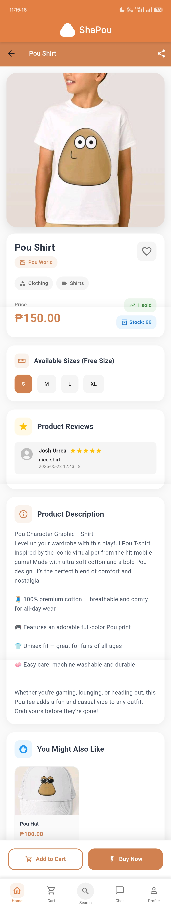

# ShaPou 🛍️  
A nostalgic, Pou-themed mobile shopping app

---

## 📱 APK Downloads

- 📦 [Final Presentation APK](https://drive.google.com/file/d/1t1i853xev20nFY7-IWTVpO0Qf7NkFL3i/view?usp=sharing)
- 🧪 [User Feedback APK](https://drive.google.com/file/d/1kiJxkBP6qTGMNK4ubPqhgn_GlwiKungN/view?usp=sharing)

> Install these on an Android device to explore and test the ShaPou shopping experience.

---

## 📄 Project Documentation

### 📝 App Description

**ShaPou** is a mobile shopping experience inspired by the iconic Pou virtual pet game. The app offers a wide range of Pou-themed merchandise — from mugs and hats to apparel and accessories — as well as general lifestyle products. Whether you're a long-time Pou fan or simply love fun and nostalgic shopping, ShaPou makes it easy to browse and buy from anywhere.

---

### 🎯 Objectives

- Deliver a **fun and user-friendly** mobile shopping experience for both Pou fans and casual shoppers.
- Feature **exclusive Pou-themed merchandise** that appeals to nostalgic gamers and new fans alike.
- Provide a **secure and modern e-commerce experience** using Firebase and Supabase.
- Seamlessly integrate **user login, product browsing, and checkout** in one mobile interface.
- Encourage continued engagement through **personalized shopping features**.

---

### 👥 Target Users

- 🎮 Fans of the Pou mobile game  
- 🛒 Casual online shoppers looking for unique merchandise  

---

### 📸 Screenshots of Each Feature

### 📸 Screenshots of Each Feature

> Screenshots are shown below for each feature and major page of the ShaPou app.  

| **Feature / Page**        | **Screenshot(s)** |
|---------------------------|-------------------|
| Home Page                 |  |
| Product Details           |  |
| Profile Page              | .jpg)   |
| Login                     |  |
| Register                  |  |
| Wishlist                  |   |
| Address Management        |   |
| About Us                  |  |
| Seller Request Form       |  |
| Edit Profile              |  |
| Chat / Messaging          |    |
| Search Page               |   |
| Cart                      |   |
| Checkout                  |    |
| Purchase History          |    |
| Product Reviews           |  |
| Seller Dashboard          |   |
| Add Product               |   |
| Manage Products           |  |
| Edit Product              |  |
| Order Management (Admin)  |    |

---

### 🛠 Technologies and Tools Used

| Tool                  | Purpose                            |
|-----------------------|------------------------------------|
| **Flutter & Dart**    | Cross-platform mobile development  |
| **Firebase**          | User authentication and backend    |
| **Supabase**          | Image storage (products & profiles)|
| **Visual Studio Code**| Development environment            |
| **Android Device**    | Testing and deployment             |

---

## 👨‍💻 Group Member Contributions

| Member Name                    | Contributions |
|--------------------------------|----------------|
| **Pagalanan, Jon Enrico B.**   | Provided the laptop for system testing, acted in the video advertisement, contributed to UI design, and assisted with the final presentation |
| **Bauyon, Myrajoy B.**         | Designed the application, created the Google Forms for respondent feedback, edited the video advertisement, and assisted with the final presentation |
| **Urrea, Joshua Theophilus M.**| Lead developer: handled app coding, resolved bugs, ensured clean and readable code, and supported the final presentation preparation |

> *All members collaborated on planning, development, and debugging.*

---
© 2025 ShaPou Team – Final Project Submission  
